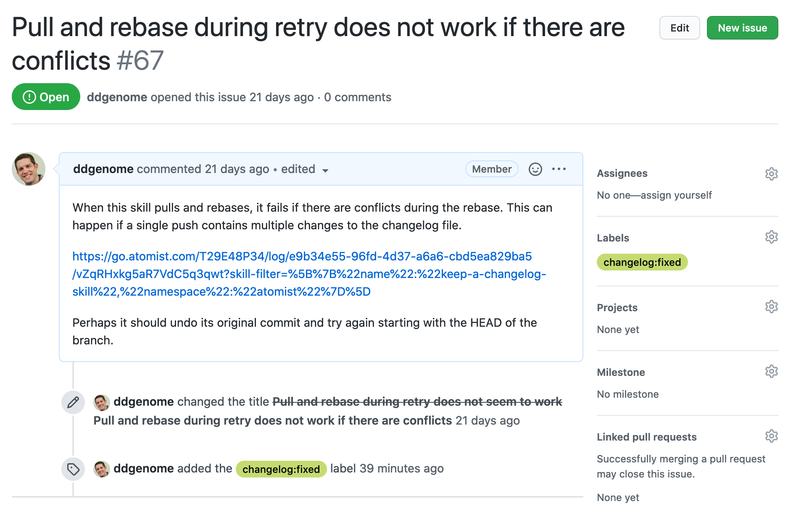
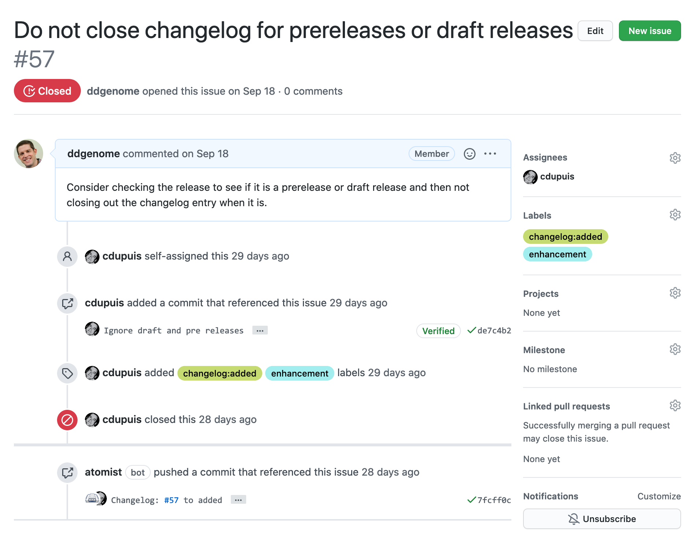
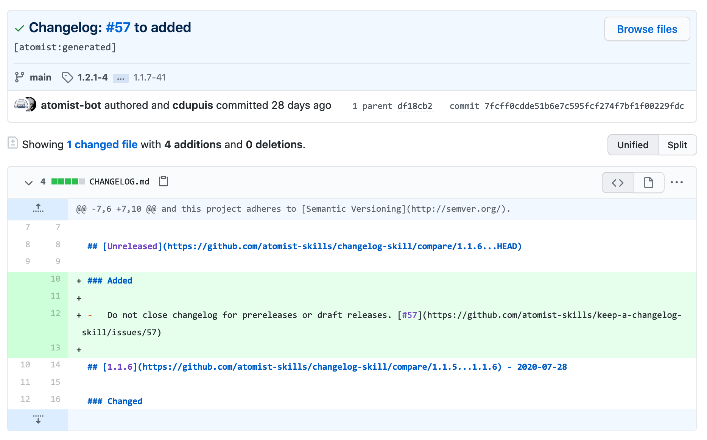
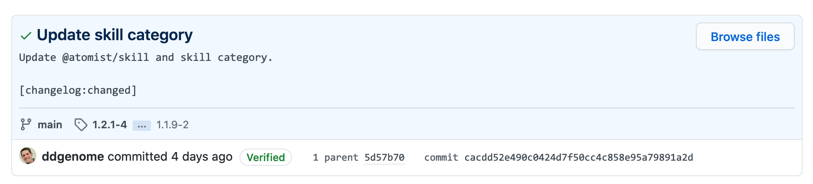
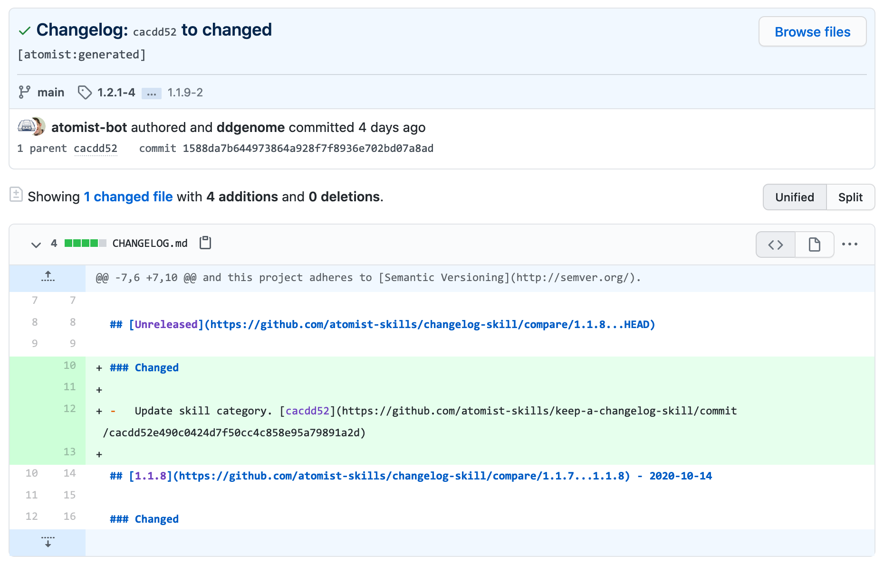
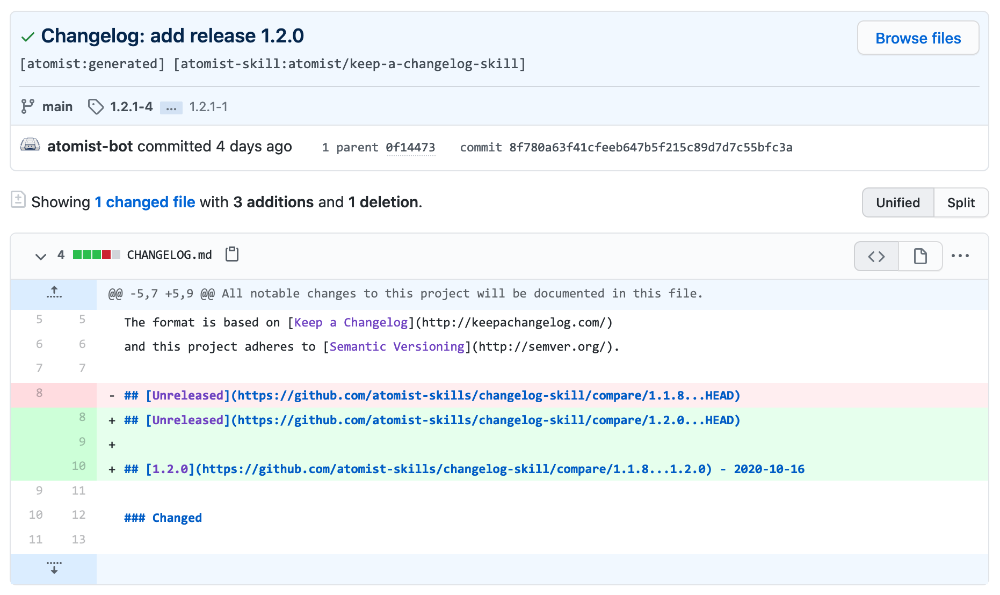
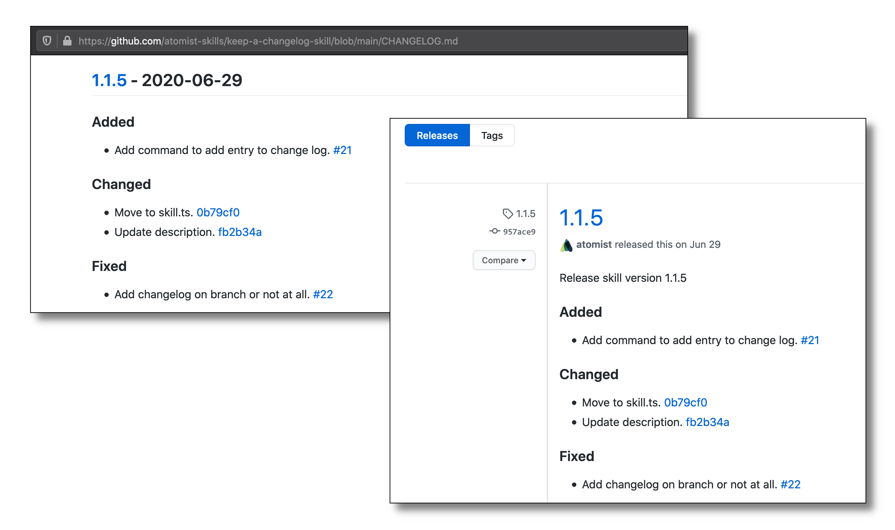

Changelog files are useful to communicate to your users and other developers
what is changing in your repository from one release to the next. Unfortunately,
maintaining a changelog file can be a bit of a chore. This skill aims to
eliminate the toil of maintaining a changelog file by providing a simple means
to have changelog entries and releases added via commits, issues, pull requests,
and releases on GitHub.

Changelog files managed by this skill follow the [Keep a Changelog][changelog]
conventions. As an example, the [`CHANGELOG.md`][kac-changelog] file for this
skill is managed by this skill.

[changelog]: https://keepachangelog.com/ "Keep a Changelog"
[kac-changelog]:
    https://github.com/atomist-skills/keep-a-changelog-skill/blob/master/CHANGELOG.md
    "Keep a Changelog Skill Changelog"

Changelog entries are created by this skill when commits are pushed with
changelog markers in the commit message, e.g., `[changelog:fixed]`, and when
issues and pull requests with changelog labels, e.g., <span
style="background-color:rgb(197,219,113);box-shadow:none;box-sizing:border-box;color:rgb(0,0,0);display:inline-block;font-size:12px;font-weight:500;line-height:18px;margin-bottom:2px;margin-left:0px;margin-right:2px;margin-top:2px;overflow-wrap:break-word;padding-bottom:0px;padding-left:7px;padding-right:7px;padding-top:0px;">changelog:added</span>,
are closed. The changelog entries are put in the **Unreleased** section of the
changelog file. Releases are added to the changelog file when releases are
created on GitHub. In other words, all you need to do is add some text to your
commit messages and/or label your issues and pull requests to fully automate the
management of your changelog files. you'll never need to manually edit a
changelog file again!

As described on [Keep a Changelog][changelog], the following classes of changes
are supported as changelog entries.

-   **Added**: new features
    -   Issue/PR label:
        <span style="background-color:rgb(197,219,113);box-shadow:none;box-sizing:border-box;color:rgb(0,0,0);display:inline-block;font-family:-apple-system,BlinkMacSystemFont,Segoe UI,Helvetica,Arial,sans-serif,Apple Color Emoji,Segoe UI Emoji;font-size:12px;font-weight:500;line-height:18px;margin-bottom:2px;margin-left:0px;margin-right:2px;margin-top:2px;overflow-wrap:break-word;padding-bottom:0px;padding-left:7px;padding-right:7px;padding-top:0px;text-decoration:rgb(0,0,0);text-decoration-color:rgb(0,0,0);text-decoration-line:none;text-decoration-style:solid;text-decoration-thickness:auto;">changelog:added</span>
    -   Commit message marker: `[changelog:added]`
-   **Changed**: changes in existing functionality
    -   Issue/PR label:
        <span style="background-color:rgb(197,219,113);box-shadow:none;box-sizing:border-box;color:rgb(0,0,0);display:inline-block;font-family:-apple-system,BlinkMacSystemFont,Segoe UI,Helvetica,Arial,sans-serif,Apple Color Emoji,Segoe UI Emoji;font-size:12px;font-weight:500;line-height:18px;margin-bottom:2px;margin-left:0px;margin-right:2px;margin-top:2px;overflow-wrap:break-word;padding-bottom:0px;padding-left:7px;padding-right:7px;padding-top:0px;">changelog:changed</span>
    -   Commit message marker: `[changelog:changed]`
-   **Deprecated**: soon-to-be removed features
    -   Issue/PR label:
        <span style="background-color:rgb(197,219,113);color:rgb(0,0,0);display:inline-block;font-family:-apple-system,BlinkMacSystemFont,Segoe UI,Helvetica,Arial,sans-serif,Apple Color Emoji,Segoe UI Emoji;font-size:12px;font-weight:500;line-height:18px;margin-bottom:2px;margin-left:0px;margin-right:2px;margin-top:2px;overflow-wrap:break-word;padding-bottom:0px;padding-left:7px;padding-right:7px;padding-top:0px;">changelog:deprecated</span>
    -   Commit message marker: `[changelog:deprecated]`
-   **Removed**: now removed features
    -   Issue/PR label:
        <span style="background-color:rgb(197,219,113);color:rgb(0,0,0);display:inline-block;font-family:-apple-system,BlinkMacSystemFont,Segoe UI,Helvetica,Arial,sans-serif,Apple Color Emoji,Segoe UI Emoji;font-size:12px;font-weight:500;line-height:18px;margin-bottom:2px;margin-left:0px;margin-right:2px;margin-top:2px;padding-bottom:0px;padding-left:7px;padding-right:7px;padding-top:0px;">changelog:removed</span>
    -   Commit message marker: `[changelog:removed]`
-   **Fixed**: bug fixes
    -   Issue/PR label:
        <span style="background-color:rgb(197,219,113);color:rgb(0,0,0);display:inline-block;font-family:Segoe UI,Helvetica,Arial,sans-serif;font-size:12px;font-weight:500;line-height:18px;margin-bottom:2px;margin-left:0px;margin-right:2px;margin-top:2px;padding-bottom:0px;padding-left:7px;padding-right:7px;padding-top:0px;">changelog:fixed</span>
    -   Commit message marker: `[changelog:fixed]`
-   **Security**: vulnerability fixes
    -   Issue/PR label:
        <span style="background-color:rgb(197,219,113);color:rgb(0,0,0);display:inline-block;font-size:12px;font-weight:500;line-height:18px;margin-bottom:2px;margin-left:0px;margin-right:2px;margin-top:2px;padding-bottom:0px;padding-left:7px;padding-right:7px;padding-top:0px;">changelog:security</span>
    -   Commit message marker: `[changelog:security]`

This skill adds the Issue/PR labels to each repository it is enabled on, so you
simply need to apply the labels to your issues and pull requests at any time
before they are closed. The changelog entry text will be the title of the issue
or pull request. Applying multiple changelog labels, and therefore creating
entries in multiple changelog sections, is supported.



The changelog commit message marker can be included anywhere in the commit
message. The changelog entry text will be the title, i.e., the first line, of
the commit message. Including multiple changelog markers in the commit message,
and therefore creating entries in multiple changelog sections, is supported.

```
$ git commit -m "Remove build script" -m "[changelog:removed]"
[main 90d2ad2] Remove build script
 1 file changed, 1 insertion(+)
```

If you are not using GitHub Releases, a release header can be added to the
changelog file by running a command from chat. In a channel that is linked to
one or more repositories, run the `@atomist close changelog` command.

### Changelog entries created from closed issue





### Changelog entries created from commit message





### Create release header in changelog file



### Add changelog entries to GitHub Release description


