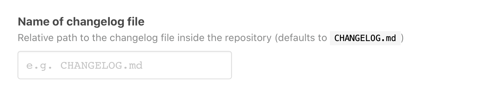

# `atomist/keep-a-changelog-skill`
          
<!---atomist-skill-description:start--->

Automatically keep a changelog updated based on labels added to issues, pull requests and commits

<!---atomist-skill-description:end--->

<!---atomist-skill-readme:start--->

# What it's useful for

With this skill you can automatically keep a changelog file in your repository up to date by using labels on GitHub
issues and pull requests as well as keywords in commit messages. 

The changelog file follows the [Keep A Changelog](https://keepachangelog.com) conventions. 

Applying the `changelog:added` label to an issue or pull request will add a corresponding entry to the _Added_ section 
of the changelog when the issue or pull request gets closed. _Keep A Changelog_ suggests the following categories of 
entries which this skill supports:

* `Added` for new features.
* `Changed` for changes in existing functionality.
* `Deprecated` for soon-to-be removed features.
* `Removed` for now removed features.
* `Fixed` for any bug fixes.
* `Security` in case of vulnerabilities.

To mark an issue or pull request for one or more of those categories, apply the matching `changelog:` labels to it. 
Once this skill is enabled, the corresponding labels will be available on the selected repositories automatically.

Additionally, you can embed markers in your commit message to add a commit to the changelog. For example adding
`[changelog:removed]` to your commit message will add the commit to the changelog in the _Removed_ category. 

The changelog entries are written when issues or pull requests get closed, or a commit is being pushed. Those entries
are kept in the _Unreleased_ section of the changelog until a GitHub release is created. The release will close the
section in the changelog by adding the name of the release to it.   

# Before you get started

Connect and configure these integrations:

1. **GitHub**

The **GitHub** integration must be configured in order to use this skill. At least one repository must be selected. 

# How to configure

1. **Configure the name of the changelog file**

    
    
    The default name of the changelog file in the repository is `CHANGELOG.md` in the root of the project.
    Use this setting to change the name and path.

2. **Determine repository scope**

    

    By default, this skill will be enabled for all repositories in all organizations you have connected.

    To restrict the organizations or specific repositories on which the skill will run, you can explicitly choose 
    organization(s) and repositories.

# How to keep a changelog

1. **Configure skill, set changelog file path** 

2. **Add `changelog:` labels to issues or pull requests or include changelog markers in your commits**

3. **Close issues or merge pull requests marked with `changelog:` labels**

3. **Enjoy not having to manually maintain a changelog file!**

To create feature requests or bug reports, create an [issue in the repository for this skill](https://github.com/atomist-skills/changelog-skill/issues). 
See the [code](https://github.com/atomist-skills/changelog-skill) for the skill.

<!---atomist-skill-readme:end--->
 
---

Created by [Atomist][atomist].
Need Help?  [Join our Slack workspace][slack].

[atomist]: https://atomist.com/ (Atomist - How Teams Deliver Software)
[slack]: https://join.atomist.com/ (Atomist Community Slack)
