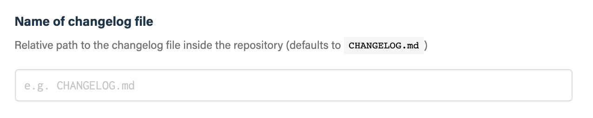
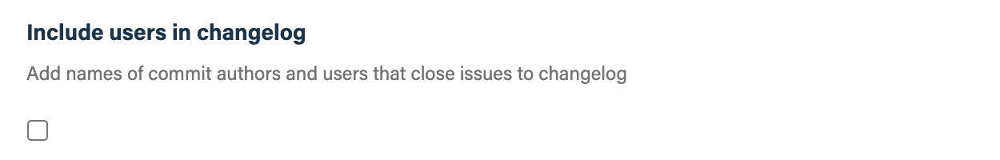
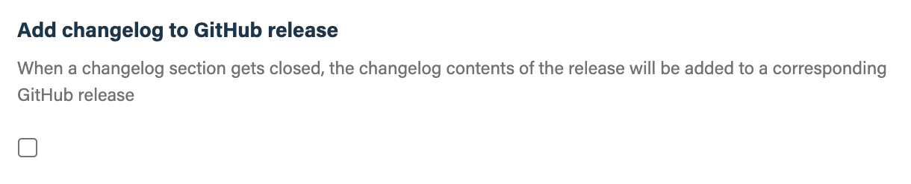

## Before you get started

Connect and configure these integrations:

1.  [**GitHub**][github] _(required)_
2.  [**Slack**][slack] or [**Microsoft Teams**][msteams] _(optional)_

[github]: https://go.atomist.com/catalog/integration/github "GitHub Integration"
[slack]: https://go.atomist.com/catalog/integration/slack "Slack Integration"
[msteams]:
    https://go.atomist.com/catalog/integration/microsoft-teams
    "Microsoft Teams Integration"

## How to configure

1.  **Configure the name of the changelog file**

    The default name of the changelog file in the repository is `CHANGELOG.md`
    in the root of the project. Use this setting to customize the name and path,
    if necessary.

    

2.  **Add user names to changelog entries**

    Decide if you want to include GitHub user names for committers and issue
    closers to be added to changelog entries.

    

3.  **Add changelog to GitHub release**

    Decide if you would like the changelog file entries for a release to be
    added to the GitHub release description.

    

4.  **Determine repository scope**

    By default, this skill will be enabled for all repositories in all
    organizations you have connected.

    To restrict the organizations or specific repositories on which the skill
    will run, you can explicitly choose organization(s) and repositories.

    

5.  **Activate the skill**

    Save your configuration and activate the skill by clicking the "Enable
    skill" button.
